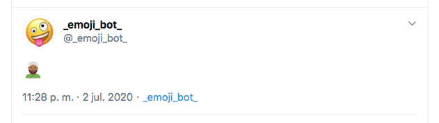

# twitter-emoji-bot-v2

This is a Twitter bot created with TypeScript to run on Node.js. This bot tweets an emoji on Twitter every few minutes.  

Example: [@_emoji_bot_](https://twitter.com/_emoji_bot_/status/1278802638700711939)  

## Some useful links
* https://apps.twitter.com 
* https://developer.twitter.com/en/docs/media/upload-media/api-reference
* https://developer.twitter.com/en/docs/media/upload-media/api-reference/post-media-upload
* https://developer.twitter.com/en/docs/tweets/post-and-engage/api-reference/post-statuses-update

## How to use
* Download repo
* Install dependencies: `npm install`
* Configure the application:
  * Duplicate the configuration file `_env` and rename it as `.env`
  * Edit the file `.env` with the authentication data of Twitter
* Run the bot with: `npm start`

## Suggestion
You can deploy this code as a Node.js app on [Heroku](https://www.heroku.com/home)

### Scripts

#### `npm run start:dev`

Starts the application in development using `nodemon` and `ts-node` to do hot reloading.

#### `npm run build`

Builds the app at `build`, cleaning the folder first.

#### `npm run start`

Starts the app in production by first building the project with `npm run build`, and then executing the compiled JavaScript at `build/index.js`.

#### `npm run lint`

This run the linter.

#### `npm run purgue`

Remove the folders: "build", "coverage" and "node_modules".

#### `npm run test`

Execute the test with coverage report.

#### `npm run test:watch`

Execute test using watch option.
